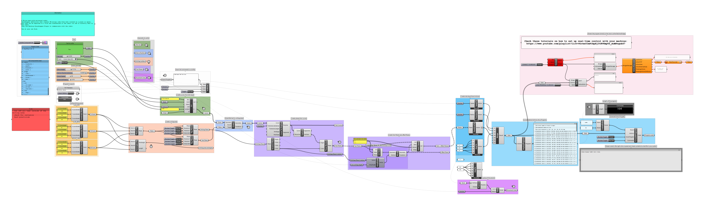

# Write-Text-with-Robot
Very simple Grasshopper definition that **creates native robot-code from text** located on a plane in space. The code can be exported to a file and transferred to the robot via usb or directly sent to the robot via a network connection.
Uses the Machina-Grasshopper-Plugin to communicate with the robot. Needs [**Machina Bridge**](https://github.com/RobotExMachina/Machina-Bridge) to send directly to the robot. 

Can be used with any Robot that Machina can communicate with (ABB, UR, KUKA).

The machina Plugin can be exchanged for any Robot Plugin for Grasshopper. See [here for a full list](https://github.com/robin-gdwl/Robots-in-Grasshopper).

## Requirements
[Rhinoceros3D **5 or 6** ](https://www.rhino3d.com/)
Grasshopper (included in Rhino6)

**GH-Plugins:** 
[Machina (0.8.8+)](https://github.com/RobotExMachina/Machina-Grasshopper)

### created by Robin Godwyll
Robot lab residency Summer 2019
BURG Halle University of Art and Design Germany

